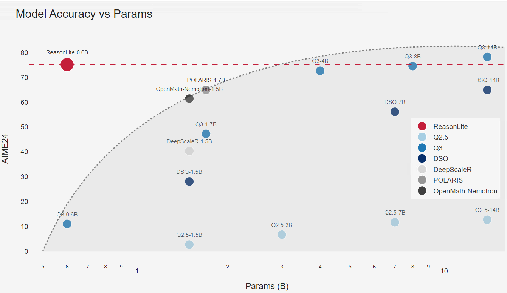
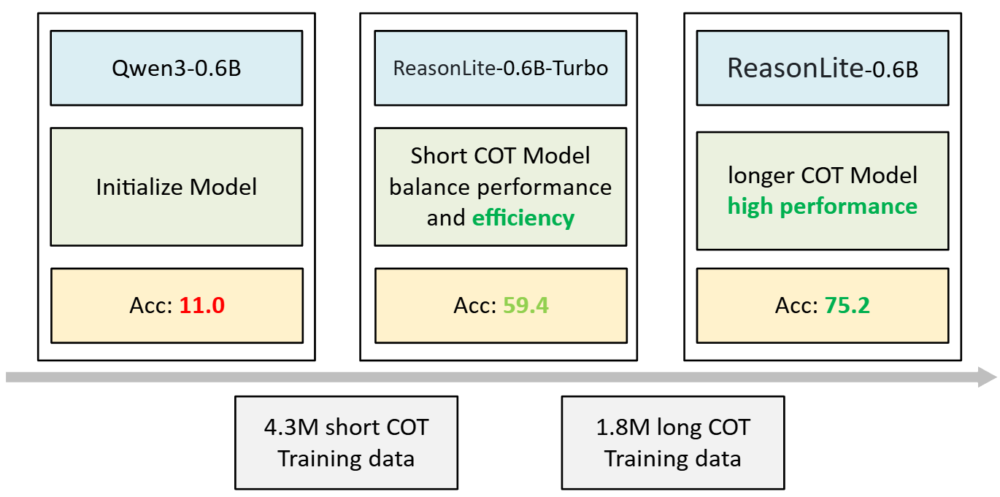
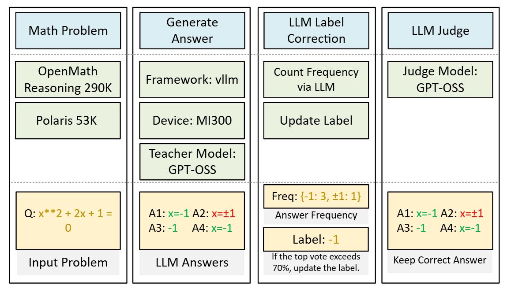

<p align="center">
  
</p>


## Introduction

* **ReasonLite is an ultra-lightweight math reasoning model.** With only 0.6B parameters, it leverages **high-quality data distillation** to achieve performance comparable to models over 10× its size, such as Qwen3-8B, **reaching 75.2 on AIME24 and extending the scaling law of small models.**
* The project is fully open-source, including **model weights**, **training scripts**, **training data**, and the **data synthesis + filtering pipeline**.

<p align="center">
  
</p>

## Model

The model is trained in **two progressive distillation stages**.
First, short-CoT data is used to distill **Qwen3-0.6B** into **AMD-0.6B-Turbo**, improving **AIME24 accuracy from 11.0 → 57.1**.
Then, long-CoT data is used to obtain **AMD-0.6B**, further boosting accuracy to **75.2**.

<p align="center">
  
</p>


**Evaluation Results**: We evaluate model performance on math reasoning tasks.  
- **avg@16**: The average accuracy over 16 independently generated answers.  
- **pass@8**: The probability that at least one correct answer appears among 8 generated samples.


| Model                     | Parameters | AMC23 avg@16 | AMC23 pass@8 | AIME25 avg@16 | AIME25 pass@8 | AIME24 avg@16 | AIME24 pass@8 |
|---------------------------|------------|-------------|-------------|---------------|---------------|---------------|---------------|
| Qwen2.5-14B               | 14B        | 58.3        | 82.3        | 12.3          | 32.3          | 12.7          | 32.4          |
| Deepseek-qwen-14B         | 14B        | 93.9        | 98.7        | 50.2          | 71.0          | 65.0          | 83.0          |
| Qwen3-0.6B                | 0.6B       | 52.7        | 85.0        | 16.0          | 33.0          | 11.0          | 31.5          |
| Qwen3-1.7B                | 1.7B       | 83.4        | 96.3        | 36.0          | 55.1          | 47.3          | 73.9          |
| Qwen3-4B                  | 4B         | 96.1        | 100         | 63.5          | 85.4          | 72.7          | 85.1          |
| Qwen3-8B                  | 8B         | 94.8        | 100         | 68.3          | 84.2          | 74.6          | 85.0          |
| Qwen3-14B                 | 14B        | 98.6        | 98.7        | 71.5          | 84.1          | 78.3          | 88.4          |
| DeepscaleR-1.5B           | 1.5B       | 83.8        | 95.0        | 29.0          | 48.9          | 40.4          | 69.0          |
| POLARIS-1.7B-Preview      | 1.7B       | 92.2        | 97.4        | 52.3          | 80.2          | 65.0          | 76.7          |
| OpenMath-Nemotron-1.5B    | 1.5B       | 88.8        | 96.7        | 39.8          | 65.8          | 61.5          | 81.3          |
| ReasonLite-0.6B-Turbo     | 0.6B       | 81.6        | 99.3        | 42.7          | 69.2          | 57.1          | 79.6          |
| **ReasonLite-0.6B**       | **0.6B**   | **95.2**    | **100**     | **62.9**      | **84.1**      | **75.2**      | **90.2**      |

**Model Link**

| Model                     | Description                                   | AIME24 | Link |
| ------------------------- | ----------------------------------------------| ------ | ---- |
| **amd/ReasonLite-0.6B-Turbo** | Short CoT balancing performance and efficiency | 57.1  | [🤗 HuggingFace](https://huggingface.co/amd/ReasonLite-0.6B-Turbo) |
| **amd/ReasonLite-0.6B**       | Long CoT for high performance                  | 75.2  | [🤗 HuggingFace](https://huggingface.co/amd/ReasonLite-0.6B) |

## Dataset

* A total of **343K math problems** originated from [Polaris](https://huggingface.co/datasets/POLARIS-Project/Polaris-Dataset-53K) and [OpenMathReasoni](https://huggingface.co/datasets/nvidia/ngOpenMathReasoni).
* Using the **GPT-OSS** model as the teacher, **9.1M** model-generated raw answers were collected under both medium and high reasoning modes.
* Pseudo-labels are created by majority voting over the model outputs.
* Finally, **6.1M samples** were retained, including **4.3M medium-level** and **1.8M high-level** reasoning data.

<p align="center">
  
</p>

**Dataset Link**

| Dataset                | Description | Size | Link |
| ---------------------- | ------      |---- | ---- |
| **amd/ReasonLite-Dataset** | Short CoT | 4.3M  | [🤗 HuggingFace](https://huggingface.co/datasets/amd/ReasonLite-Dataset/viewer/default/medium) |
| **amd/ReasonLite-Dataset**  | Long CoT | 1.8M  | [🤗 HuggingFace](https://huggingface.co/datasets/amd/ReasonLite-Dataset/viewer/default/high) |


## Setup Environment

Docker:

```bash
# Recommended ROCm Docker
rocm/vllm-dev:open-mi300-08052025

# Recommended CUDA Docker (latest vLLM)
docker.io/vllm/vllm-openai:latest
```

Install Python packages for data synthesis and evaluation:

```bash
pip install -r requirements.txt
```

## Model Training

This project uses [open-r1](https://github.com/huggingface/open-r1?tab=readme-ov-file#sft-distillation) as the training codebase, but you can use any other training framework as well.
Below are example launch scripts and YAML configurations used in our experiments.

```
# Stage 1 SFT

# Example training script:
train/stage1.sh

# Example YAML config:
train/config_stage1.yaml


# Stage 2 SFT

# Example training script:
train/stage2.sh

# Example YAML config:
train/config_stage2.yaml
```

## Model Evaluation

Example for evaluating **ReasonLite-0.6B on AIME24**. The evaluation scripts are based on [DeepMath](https://github.com/zwhe99/DeepMath).

```bash
cd eval
python3 start.py -c config/eval.yaml
```

## Data Generation Pipeline

You will need to edit the configuration file `config/oss.yaml`, or create a new one based on your own needs.
Then you may run through the full pipeline as follows.

### Start vLLM Server

```bash
python3 vllm_start.py -c config/oss.yaml
```

### Synthetic Data

**Generate model answers**

```bash
python3 infer.py -c config/oss.yaml -m infer
```

### Pseudo-Labels via Voting (Optional)

**Obtain pseudo-labels through majority voting**

```bash
python3 infer.py -c config/oss.yaml -m vote
```

### Judging Answer Correctness

**Judge correctness using provided labels**

```bash
python3 infer.py -c config/oss.yaml -m judge
```

**Judge correctness using pseudo-labels** (requires running `vote` first)

```bash
python3 infer.py -c config/oss.yaml -m judge_vote
```

### Filtering and Converting to Training Format

**Filter out incorrect solutions and convert the correct ones to training format.**
Specify the path to the judged data:

```bash
python3 utils/saving_to_training_format.py -d path/to/judged/data.jsonl
```

### Directory Structure for Data Storage

```
datas/
└── <experiment_name>/
    ├── info.jsonl           # input prompts
    ├── answer_origin/       # raw generations
    │   └── <timestamp>/
    │       └── 0_1.jsonl
    ├── answer_judge/        # judged generations
    │   └── <timestamp>/
    │       └── 0_1.jsonl
    ├── vote/                # majority votes per prompt
    │   └── <timestamp>/
    │       └── 0_1.jsonl
    └── answer_judge_vote/   # judged using vote labels
        └── <timestamp>/
            └── 0_1.jsonl
```

### JSONL Examples

#### info.jsonl

The files `info.jsonl` and `vote/<timestamp>/0_1.jsonl` follow this format:

```jsonl
{
    "prompt": "Solve the equation (x^2 - x - 2 = 0).",
    "expected_answer": "5",
    "index": "pol:0",
    "vote": {"x=2,-1": 5, "x=2": 1}  // Only in vote/<timestamp>/0_1.jsonl
}
```

* `prompt` contains the math problem
* `expected_answer` is the ground-truth label
* `index` is the global ID using the format `"dataset_name:index"`
* `vote` shows the voting results (only in vote files)

#### Intermediate Result JSONL

Files under
`answer_origin/<timestamp>/0_1.jsonl`,
`answer_judge/<timestamp>/0_1.jsonl`,
`answer_judge_vote/<timestamp>/0_1.jsonl`
follow this format:

```jsonl
{
    "info": "<input info from info.jsonl>",
    "index": "pol:0_3",
    "model_input": "<full input ...>",
    "model_output": "<full output with input prepended ...>",
    "prompt": "The front tires of a car wear out after 25,000 km, ...",
    "answer": "<model output ...>",
    "judge": true  // Only in answer_judge and answer_judge_vote
}
```

* Files under `answer_origin` contain raw model trajectories
* `answer_judge` and `answer_judge_vote` add the boolean `judge` flag indicating correctness

## Citation

```
@misc{reasonlite2025,
  title    = {ReasonLite: An Ultra-Lightweight 0.6B Reasoning Model},
  author   = {An, Zihao and Chen, Chushi and Liu, Ziqiong and Li, Dong and Barsoum, Emad},
  year     = {2025},
  url      = {https://github.com/AMD-AGI/ReasonLite},
  note     = {Open-source project}
}
```
